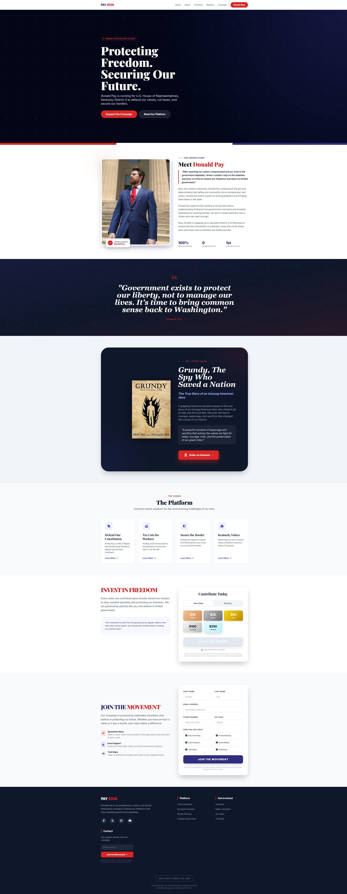

# Donald Pay — Setup Guide

## 1. Push to GitHub

```bash
cd donaldpay
git init
git add .
git commit -m "Initial site"
git branch -M main
git remote add origin https://github.com/<your-username>/donaldpay.git
git push -u origin main
```

## 2. Connect the repo to Cloudflare Pages

1. Cloudflare dashboard → **Workers & Pages** → **Create application** → **Pages** → **Connect to Git**.
2. Pick the `donaldpay` repo.
3. Build settings:
   - **Framework preset:** None
   - **Build command:** (leave blank)
   - **Build output directory:** `/`
4. Deploy. Cloudflare will auto-detect the `functions/api/contact.js` file and wire it up as a Pages Function — no extra config needed.
5. Add your custom domain (`donaldpay.com`) under the Pages project's **Custom domains** tab. Since the domain is already on Cloudflare, this is usually a one-click DNS update.

## 3. DNS records for the contact form (MailChannels)

The contact form sends mail through MailChannels' free API, using `donald@donaldpay.com` as the sender. MailChannels requires two DNS records on your domain so it knows your site is allowed to send mail as you (this also avoids your messages getting flagged as spam).

Add these in **Cloudflare DNS** for `donaldpay.com`:

**1. SPF-style domain lockdown TXT record** (proves your Cloudflare Pages site is allowed to send via MailChannels):

| Type | Name | Content |
|------|------|---------|
| TXT | `_mailchannels` | `v=mc1 cfid=<your-pages-project>.pages.dev` |

Replace `<your-pages-project>` with your actual `*.pages.dev` subdomain shown in the Cloudflare Pages dashboard.

**2. DKIM record** (optional but recommended — improves deliverability):

MailChannels' docs walk through generating a DKIM key pair and adding it as a TXT record. If you skip this, mail will likely still send, but may land in spam more often. See: https://support.mailchannels.com/hc/en-us/articles/4565898358413

**3. Make sure your domain's regular SPF record (if any) includes MailChannels:**

| Type | Name | Content |
|------|------|---------|
| TXT | `@` | `v=spf1 include:relay.mailchannels.net ~all` |

If you already have an SPF record, add `include:relay.mailchannels.net` into it rather than creating a second one — domains can only have one SPF TXT record.

## 4. Where the emails land

Form submissions are sent **to** `donaldpaybusiness@gmail.com`, **from** `donald@donaldpay.com`, with **reply-to** set to whoever filled out the form — so hitting "Reply" in Gmail replies straight to them, not to yourself.

## 5. Swapping in real screenshots

Each portfolio card has a placeholder block (`.work-thumb.ph-1` etc. in `styles.css`). To swap in a real screenshot:

1. Drop the image in an `assets/` folder (e.g. `assets/work-1.jpg`).
2. In `index.html`, replace:
   ```html
   <div class="work-thumb ph-1" aria-hidden="true">
     <span class="thumb-label mono">SCREENSHOT</span>
   </div>
   ```
   with:
   ```html
   <div class="work-thumb">
     
   </div>
   ```

## 6. Local preview

No build step needed — just open `index.html` in a browser, or run a tiny local server:

```bash
npx serve .
```

The `/api/contact` endpoint won't work locally unless you use `npx wrangler pages dev .` instead, which emulates Pages Functions.
